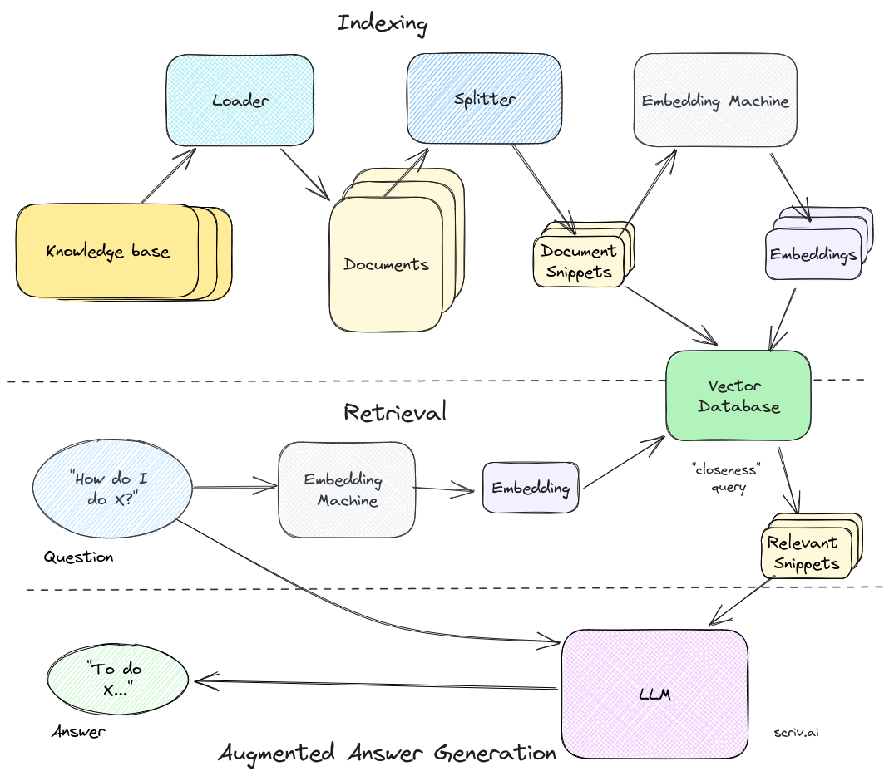

Demo: [chat.duhocsinh.se](https://chat.duhocsinh.se)

Frontend repo: [tuananhdao/chat.duhocsinh.webUI](https://github.com/tuananhdao/chat.duhocsinh.webUI)

# Roadmap
- Pinecone-GPT3: ChatGPT API for LLM, Pinecone for Vector DB
- Weaviate-Llamma2: self-hosted Llama 2 for LLM, self-hosted Weaviate for Vector DB



# Testing on local machines

## Set up environments

```bash
conda create --name rag python=3.10 -y
conda activate rag
sudo apt-get install python3-pip
pip install -r requirements.txt
```

Rename `.env.example` to `.env` and provide the corresponding API keys.

## Create database

```bash
sh build_knowledge.sh
```

## Run server API

```bash
sh serve.sh
```
The server runs at `localhost:8000`. From browser, go to `localhost:8000/q`, you should see `It is working`.

# Production deployment

Replace the occurences of `_SITE_` with the intended domain.

## DNS

Point `api._SITE_` to server IP. Open port 8000 for TCP requests.

## Install SSL certificate for `api._SITE_`

```bash
sudo apt get nginx
sudo git clone https://github.com/certbot/certbot /opt/letsencrypt
sudo certbot --nginx -d api._SITE_
sudo certbot renew --dry-run
```
Copy the key file as `key.pem` and the cert file as `cert.pem` to the repo folder.

The frontend server should also have SSL certificate.

## Set up environments

```bash
sudo apt install software-properties-common -y
sudo add-apt-repository ppa:deadsnakes/ppa
sudo apt update
sudo apt install python3.10
sudo apt install python3-pip
pip install -r requirements.txt
```

## Create database

```bash
sh build_knowledge.sh
```

## Run server API
```bash
sh serve.sh
```
